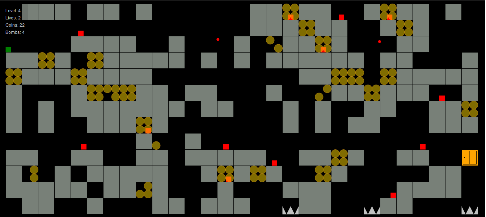

# STFD ( Shut The Front Door)
A randomly generated platformer game.   
Please view a live demo at : https://codepen.io/niitettehtsuru/pen/PoNYeKX 

 
## Getting Started

These instructions will get you a copy of the project up and running on your local machine for development and testing purposes. 

### How the game is played

The player is the green square. 
Player can jump up to 3 blocks high. 
A level is complete if player is completely inside the door(on the right edge of the screen). 
The player gets an extra life after collecting 100 coins.  
Player dies if player collides with bugs(red squares),red balls, 
saws(jagged edges at the bottom), lava spit or dripping hot lava. 

1. Navigate using the arrow keys.  
* Left arrow key to go left. 
* Right arrow key to go right. 
* Up arrow key to jump. 
* Down arrow key to descend. 
2. Shoot to kill a red square(bug) by pressing the space bar. 
3. Drop a bomb to destroy some blocks by pressing the "B" key. 
NB: This is useful if the player is trapped. You can only drop 4 bombs per level. Hence use bombs wisely. 
AND, a bomb can't kill you. 

### Prerequisites

All you'll ever need is a working web browser. That's it.

### Installing
Open the index.html file in your web browser. It's that simple. 
 
## Built With

* Vanilla Javascript 
* jQuery 
* Twitter Bootstrap
* p5.js   

## Authors 

* **Caleb Nii Tetteh Tsuru Addy** 
 
## License

This project is licensed under the GNU General Public License v3.0.
